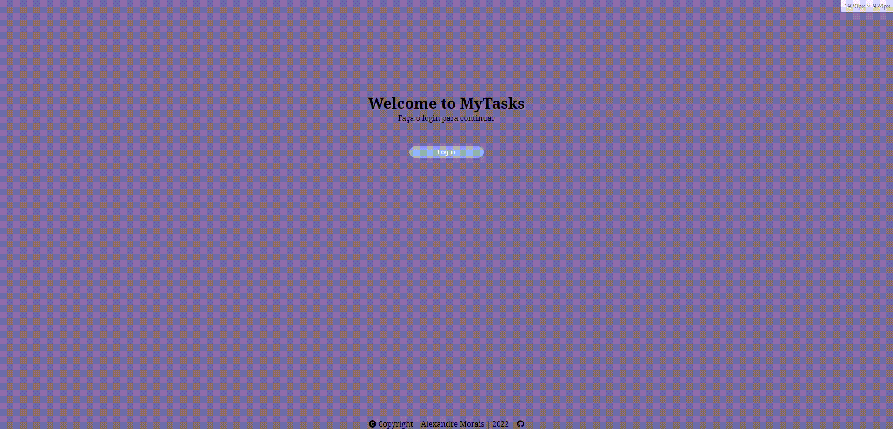

# Mytasks

# Overview

A to do app to manage your tasks.  
The intention is to learn more about Flask, Poetry and deepen knowledge in Python

# Preview

# Tasks

- [x] Config Auth0
- [x] Config hmtx
- [x] Config SQLAlchemy
- [X] Create crud operations
- [X] Create a better layout pages
- [X] Refactor the code
- [X] Deploy on heroku

This application is still under development.

Made with  ❤️